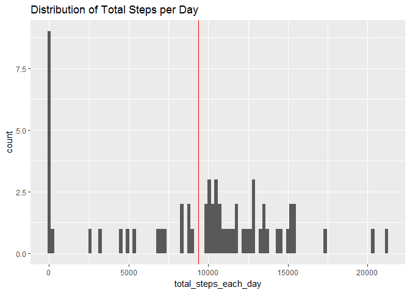
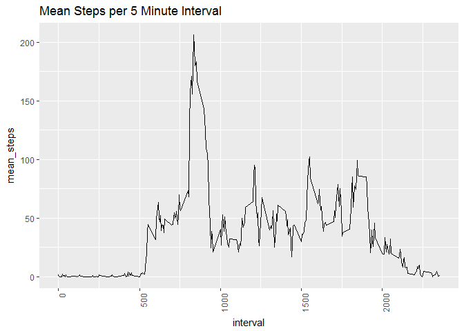
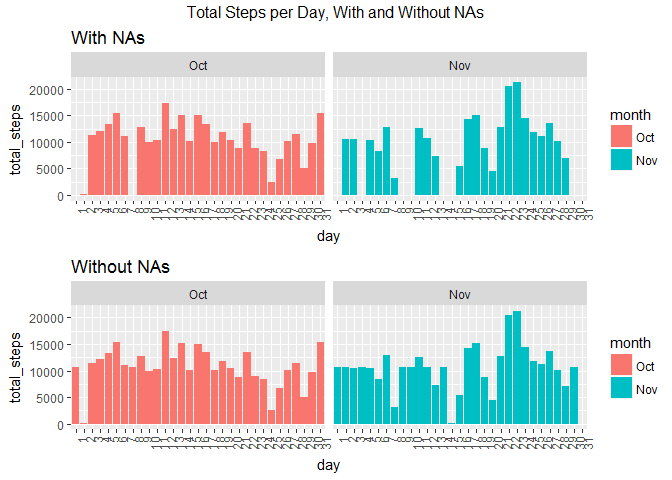
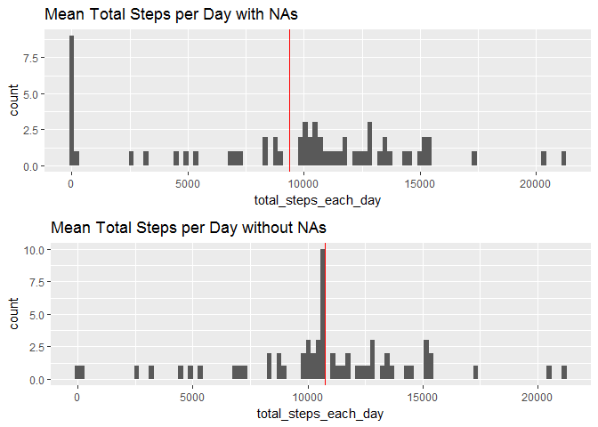
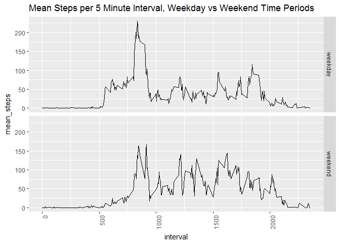

# Reproducible Research: Peer Assessment 1

##Introduction
It is now possible to collect a large amount of data about personal movement using activity monitoring devices such as a Fitbit, Nike Fuelband, or Jawbone Up. These type of devices are part of the "quantified self" movement group of enthusiasts who take measurements about themselves regularly to improve their health, to find patterns in their behavior, or because they are tech geeks. But these data remain under-utilized both because the raw data are hard to obtain and there is a lack of statistical methods and software for processing and interpreting the data.

This assignment makes use of data from a personal activity monitoring device. This device collects data at 5 minute intervals through out the day. The data consists of two months of data from an anonymous individual collected during the months of October and November, 2012 and include the number of steps taken in 5 minute intervals each day.

##Methods
The data for this assignment is located in the same repository as this Rmarkdown file:  
* Data set = activity.zip  
The variables included in this data set are:  
1. steps: Number of steps taking in a 5-minute interval (missing values are coded as.NA)  
2. date: The date on which the measurement was taken in YYYY-MM-DD format  
3. interval: Identifier for the 5-minute interval in which measurement was taken  
The data set is stored in a comma-separated-value (CSV) file and there are a total of 17,568 observations in this data set.

The following procedures were performed during analysis:  
1. Read in the data set and added month and day factor variables   
2. Created a histogram of the total number of steps taken each day   
3. Calculated Mean and median number of steps taken each day   
4. Created a time series plot of the average number of steps taken in each time interval   
5. Determined the 5-minute interval that, on average, contains the maximum number of steps     
6. Determine the number of NAs in the steps variable and created code to impute missing data (NA) with the average steps for the given 5 minute interval   
7. Create a histogram of the total number of steps taken each day after missing values are imputed   
8. Recalculate the mean and median of total number of steps each day after NAs have been replaced  
9. Panel plot comparing the average number of steps taken per 5-minute interval across weekdays and weekends   


### Loading and preprocessing the data

```r
#Show any code that is needed to
#1. Load the data (i.e. `read.csv()`)
#2. Process/transform the data (if necessary) into a format suitable for your analysis

#start by removing all current objects
rm(list=ls())

library(tidyr)
library(dplyr)
```

```
## 
## Attaching package: 'dplyr'
```

```
## The following objects are masked from 'package:stats':
## 
##     filter, lag
```

```
## The following objects are masked from 'package:base':
## 
##     intersect, setdiff, setequal, union
```

```r
library(ggplot2)
library(reshape2)
```

```
## 
## Attaching package: 'reshape2'
```

```
## The following object is masked from 'package:tidyr':
## 
##     smiths
```

```r
library(data.table)
```

```
## -------------------------------------------------------------------------
```

```
## data.table + dplyr code now lives in dtplyr.
## Please library(dtplyr)!
```

```
## -------------------------------------------------------------------------
```

```
## 
## Attaching package: 'data.table'
```

```
## The following objects are masked from 'package:reshape2':
## 
##     dcast, melt
```

```
## The following objects are masked from 'package:dplyr':
## 
##     between, first, last
```

```r
library(lubridate)
```

```
## 
## Attaching package: 'lubridate'
```

```
## The following objects are masked from 'package:data.table':
## 
##     hour, isoweek, mday, minute, month, quarter, second, wday,
##     week, yday, year
```

```
## The following object is masked from 'package:base':
## 
##     date
```

```r
library(gridExtra)
```

```
## 
## Attaching package: 'gridExtra'
```

```
## The following object is masked from 'package:dplyr':
## 
##     combine
```

```r
library(xtable)
```

```
## Warning: package 'xtable' was built under R version 3.3.3
```

```r
### read in data and clean up data
        #set working directory to folder containing csv file
        setwd("~/Joe's stuff/Stats and data analysis/R code and data/Reproducible Research - Coursera/RepData_PeerAssessment1")

        #import excel file containing IB data
        data<-read.csv(unzip("activity.zip"))
        download.data.date<-Sys.time()
        print(download.data.date)
```

```
## [1] "2017-04-22 22:51:19 PDT"
```

```r
        # code to check structure and NAs in data       
        #str(data)
        #head(data)
        #table(sum(is.na(data)))
```

```r
#Process/transform the data into a format suitable for analysis
#create factor variables for month and day
data$date<-ymd(data$date)
data$month<-as.factor(month(data$date, label = TRUE))
data$day<-as.factor(day(data$date))
```

### What is the mean total number of steps taken per day (ignoring NAs)?

```r
#For this part of the assignment, you can ignore the missing values in
#the dataset.
#1. Make a histogram of the total number of steps taken each day
        # calculate total number of steps taken each day
        total_steps_day<-data%>%group_by(date)%>%summarize(total_steps_each_day=sum(steps, na.rm=TRUE))

        # determine the mean of total steps per day
        mean_total_steps<-mean(total_steps_day$total_steps_each_day, na.rm = TRUE)
        median_total_steps<-median(total_steps_day$total_steps_each_day, na.rm = TRUE)
```
The mean of total steps per day was 9354 and the median of total steps per day was 10395. This data indicates that the data may be skewed to the left by low step values possibly NAs. 


###Distribution of total steps per day 

```r
#plot showing total number of steps by day ignoring NAs 
        ggplot(total_steps_day, aes(x=total_steps_each_day))+
                geom_histogram(bins = 100)+
                geom_vline(xintercept = mean_total_steps, color="red")+
                labs(title="Distribution of Total Steps per Day")
```

<!-- -->

```r
#2. Calculate and report the **mean** and **median** total number of steps taken per day
```

The histogram above shows the distribution of total steps for each day. The mean of total steps for each day is noted by a vertical red line. The high number of data points near 0 may be the result of NAs. The high occurrence of these low total step values appear to be pulling the mean to the left.

```r
#2. Which 5-minute interval, on average across all the days in the dataset, contains the maximum number of steps?
max_mean_int_steps<-data%>%group_by(interval)%>%summarize(mean_interval_steps=mean(steps, na.rm=TRUE))%>%arrange(desc(mean_interval_steps))%>%slice(1)
max_mean_int_steps<-as.data.frame(max_mean_int_steps)
```
Interval 835 showed the highest mean number of steps.


### What is the average daily activity pattern?

```r
#1. Make a time series plot (i.e. `type = "l"`) of the 5-minute interval (x-axis) and the average number of steps taken, averaged across all days (y-axis)

ggplot(data%>%group_by(interval)%>%summarize(mean_steps=mean(steps, na.rm=TRUE)), aes(x=interval, y=mean_steps))+
        geom_line()+
        theme(axis.text.x = element_text(angle = 90, hjust = 1))+
        labs(title="Mean Steps per 5 Minute Interval")
```

<!-- -->

The graph above shows the mean steps per 5 minute interval representing a 24 hour period. Activity seems to start sometime after 530 am and peaks around 830 am roughly.


### Imputing missing values
Note that there are a number of days/intervals where there are missing
values (coded as `NA`). The presence of missing days may introduce
bias into some calculations or summaries of the data. To minimize potential bias NAs were replaced with the mean steps for the given 5 minute interval that the NA was found within.

```r
#1. Calculate and report the total number of missing values in the dataset (i.e. the total number of rows with `NA`s)
sum_steps_NA<-sum(is.na(data$steps))
```
Total number of NAs found within steps variable = 2304


```r
#2. Devise a strategy for filling in all of the missing values in the dataset. The strategy does not need to be sophisticated. For example, you could use the mean/median for that day, or the mean for that 5-minute interval, etc.
#3. Create a new dataset that is equal to the original dataset but with the missing data filled in.
# determine mean steps per interval then use this value to replace NAs in that interval
# first determine mean steps for each interval
mean_int_steps<-data%>%group_by(interval)%>%summarize(mean_interval_steps=mean(steps, na.rm=TRUE))
# combine mean steps by interval with data dataframe so all intervals have mean value for that interval
data<-full_join(data, mean_int_steps, by="interval")

# if steps is NA then replace with mean steps that equals the same interval
# this is done by simply identifying NA then replacing with the mean_interval_steps in the same row
data_na.rm<-transform(data, steps=ifelse(is.na(steps),data$mean_interval_steps[is.na(data$steps)], steps))

# check for NAs
table(sum(is.na(data_na.rm)))
```

```
## 
## 0 
## 1
```

```r
# look at the plot of the data to make sure NAs were replaced without disrupting rest of data set
plot_with_na<-ggplot(data%>%group_by(month, day)%>%summarize(total_steps=sum(steps, na.rm=TRUE)), aes(x=day, y=total_steps, fill=month))+
        facet_grid(.~month)+
        geom_bar(stat="identity")+
        theme(axis.text.x = element_text(angle = 90, hjust = 1))+
        labs(title="With NAs")

plot_no_na<-ggplot(data_na.rm%>%group_by(month, day)%>%summarize(total_steps=sum(steps, na.rm=TRUE)), aes(x=day, y=total_steps, fill=month))+
        facet_grid(.~month)+
        geom_bar(stat="identity")+
        theme(axis.text.x = element_text(angle = 90, hjust = 1))+
        labs(title="Without NAs")

grid.arrange(plot_with_na,plot_no_na, ncol=1,top="Total Steps per Day, With and Without NAs")
```

<!-- -->

The graph above was created to visual check the impute of NA values.


```r
#4. Make a histogram of the total number of steps taken each day and Calculate and report the mean and median total number of steps taken per day. Do these values differ from the estimates from the first part of the assignment? What is the impact of imputing missing data on the estimates of the total daily number of steps?

#plots showing distribution of total number of steps by day from data with and without NAs 
mean_total_steps_with_NA<-as.numeric(mean(total_steps_day$total_steps_each_day, na.rm = TRUE))
dist_with_na<-ggplot(total_steps_day, aes(x=total_steps_each_day))+
        geom_histogram(bins = 100)+
        geom_vline(xintercept = mean_total_steps_with_NA, color="red")+
        labs(title="Mean Total Steps per Day with NAs")

total_steps_day_no_NA<-data_na.rm%>%group_by(date)%>%summarize(total_steps_each_day=sum(steps, na.rm=TRUE))
mean_total_steps_no_NA<-as.numeric(mean(total_steps_day_no_NA$total_steps_each_day, na.rm = TRUE))        

dist_without_na<-ggplot(data_na.rm%>%group_by(date)%>%summarize(total_steps_each_day=sum(steps, na.rm=TRUE)), aes(x=total_steps_each_day))+
        geom_histogram(bins = 100)+
        geom_vline(xintercept = mean_total_steps_no_NA, color="red")+
        labs(title="Mean Total Steps per Day without NAs")

grid.arrange(dist_with_na, dist_without_na, ncol=1)
```

<!-- -->

Replacing NA values with mean steps per interval helped to eliminate the skewed nature of the provided data set. 


```r
# determine total steps per day from data set without NAs
total_steps_day_no_NA<-data_na.rm%>%group_by(date)%>%summarize(total_steps_each_day=sum(steps, na.rm=TRUE))

#create a data.frame
#df<-data.frame(mean_total_steps_with_NA=numeric(), median_total_steps_with_NA=numeric(), mean_total_steps_no_NA=numeric(), median_total_steps_no_NA=numeric(), stringsAsFactors = F)

df<-data.frame(ncol=4, nrow=1)

#df = data.frame(matrix(vector(), 0, 4,
   #             dimnames=list(c(), c("mean_total_steps_with_NA", "median_total_steps_with_NA", "mean_total_steps_no_NA", "median_total_steps_no_NA"))),
    #            stringsAsFactors=F)
mean_total_steps_with_NA<-as.numeric(mean(total_steps_day$total_steps_each_day, na.rm = TRUE))
median_total_steps_with_NA<-as.numeric(median(total_steps_day$total_steps_each_day, na.rm = TRUE))
mean_total_steps_no_NA<-as.numeric(mean(total_steps_day_no_NA$total_steps_each_day, na.rm = TRUE))
median_total_steps_no_NA<-as.numeric(median(total_steps_day_no_NA$total_steps_each_day, na.rm = TRUE))

df$mean_total_steps_with_NA<-as.numeric(mean(total_steps_day$total_steps_each_day, na.rm = TRUE))
df$median_total_steps_with_NA<-as.numeric(median(total_steps_day$total_steps_each_day, na.rm = TRUE))
df$mean_total_steps_no_NA<-as.numeric(mean(total_steps_day_no_NA$total_steps_each_day, na.rm = TRUE))
df$median_total_steps_no_NA<-as.numeric(median(total_steps_day_no_NA$total_steps_each_day, na.rm = TRUE))

df<-select(df, -c(ncol,nrow))
df<-gather(df, "statistic", "value", 1:4)
print(df)
```

```
##                    statistic    value
## 1   mean_total_steps_with_NA  9354.23
## 2 median_total_steps_with_NA 10395.00
## 3     mean_total_steps_no_NA 10766.19
## 4   median_total_steps_no_NA 10766.19
```

```r
#data.frame(c(mean_total_steps_with_NA, mean_total_steps_no_NA, median_total_steps_with_NA, median_total_steps_no_NA))
```
Numerically we can see that filling in the missing NA values balanced the distribution of data so that the mean is equal to the median.


### Are there differences in activity patterns between weekdays and weekends?

```r
#For this part the `weekdays()` function may be of some help here. Use
#the dataset with the filled-in missing values for this part.
#1. Create a new factor variable in the dataset with two levels -- "weekday" and "weekend" indicating whether a given date is a weekday or weekend day.
data_na.rm$week <- ifelse(weekdays(data_na.rm$date) %in% c("Saturday", "Sunday"), "weekend", "weekday")
data_na.rm$week<-as.factor(data_na.rm$week)
```

```r
#1. Make a panel plot containing a time series plot (i.e. `type = "l"`) of the 5-minute interval (x-axis) and the average number of steps taken, averaged across all weekday days or weekend days (y-axis). The plot should look something like the following, which was created using **simulated data**:
ggplot(data_na.rm%>%group_by(week,interval)%>%summarize(mean_steps=mean(steps, na.rm=TRUE)), aes(x=interval, y=mean_steps))+
        facet_grid(week~.)+
        geom_line()+
        labs(title="Mean Steps per 5 Minute Interval, Weekday vs Weekend Time Periods")+
        theme(axis.text.x = element_text(angle = 90, hjust = 1))
```

<!-- -->

```r
mean_steps_interval<-data_na.rm%>%group_by(week,interval)%>%summarize(mean_steps=mean(steps, na.rm=TRUE))
mean_steps_weekday<-filter(mean_steps_interval, week=="weekday")%>%summarise(mean_steps_weekday=mean(mean_steps))
mean_steps_weekend<-filter(mean_steps_interval, week=="weekend")%>%summarise(mean_steps_weekday=mean(mean_steps))
```

This particular individual seemed to be more active during the weekend than during the weekdays. Calculating the overall mean of mean steps per 5 minute interval we see that during the week 36 steps were taken on average in a 5 minute time period compared to 42 steps during the weekend. 

### Conclusions   
1. Based on the activity data reporting number of steps per 5 minute interval the measured individual appears to:   
+ start their day fairly early; around 5:30 am   
+ their steps peak around 8:30 am; perhaps their job or other activity starts at 8:30 am or they bike or walk at that time then activity slows when they reach their destination   
+ this individual also seems to be slightly more active on the weekend

